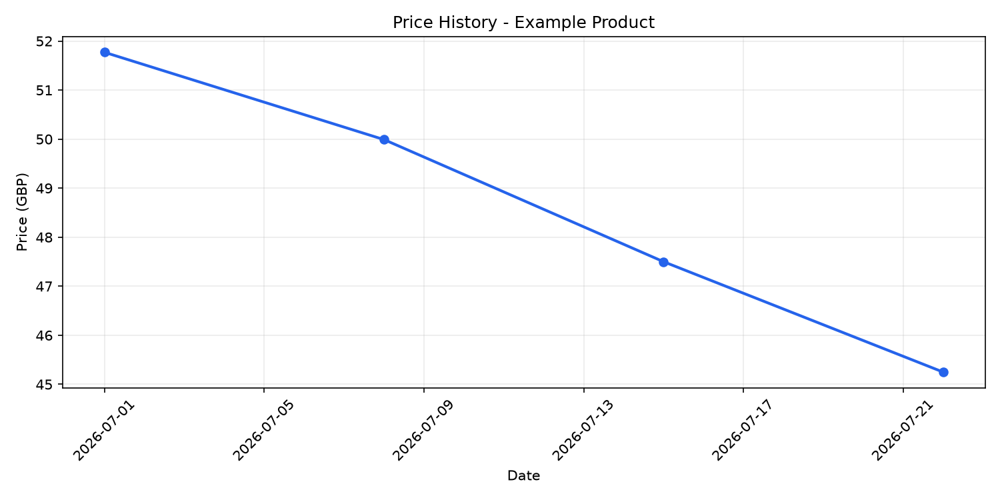

# Tech Price Tracker

[](https://github.com/agirkayamemin/tech-price-tracker/actions/workflows/tests.yml)

Tech Price Tracker is a command-line Python application that scans a product
catalog, stores prices in SQLite, detects price changes, and plots historical
price data. The current source is [Books to Scrape](https://books.toscrape.com/),
a website created for scraping practice.

## Highlights

- Exact monetary storage in minor units instead of floating-point values
- Stable product identity based on source and product URL
- Safe pagination with a 50-page hard limit and a delay between requests
- Transactional price updates and complete UTC-dated price history
- Graceful handling of malformed products and page failures
- CLI commands for scanning, listing products, and plotting history
- Offline test suite built with HTML fixtures and mocked HTTP requests
- Automated tests on GitHub Actions

## How It Works

```text
Books to Scrape
      |
      v
HTTP fetch (timeout + error handling)
      |
      v
HTML parser (products + next-page link)
      |
      v
Price parser ("GBP 51.77" -> 5177 minor units)
      |
      v
SQLite transaction
  |               |
  v               v
products      price_history
                      |
                      v
              Matplotlib chart
```

The scanner fetches one page at a time. A malformed product is logged and
skipped without discarding valid products from the same page. If a later page
fails, results from earlier pages remain safely stored and the command exits
with a failure status.

## Requirements

- Python 3.14 (the tested version for this release)
- Internet access for live scans

SQLite is included with Python. The remaining dependencies are listed in
`requirements.txt`.

## Installation

```bash
git clone https://github.com/agirkayamemin/tech-price-tracker.git
cd tech-price-tracker

python -m venv venv
source venv/Scripts/activate

python -m pip install -r requirements.txt
```

PowerShell users can activate the environment with:

```powershell
.\venv\Scripts\Activate.ps1
```

## Usage

Show the command overview:

```bash
python -m src.main
```

Scan the first catalog page:

```bash
python -m src.main scan
```

Scan at most five pages:

```bash
python -m src.main scan --max-pages 5
```

Scan the complete catalog, up to the built-in 50-page safety limit:

```bash
python -m src.main scan --all-pages
```

List all stored products or limit the output:

```bash
python -m src.main products
python -m src.main products --limit 10
```

Choose a product interactively and display its price-history chart:

```bash
python -m src.main history
```

Use a persistent database product ID directly:

```bash
python -m src.main history --product-id 7
```

## Price History Chart



The example image uses demonstration data. Live charts use the history stored
in your local SQLite database.

## Database

Application data is stored locally in `data/products.db`. The database file and
`data/app.log` are intentionally excluded from Git.

Schema version 2 uses:

- `products`: source, canonical product URL, name, current price, and currency
- `price_history`: product ID, price, currency, and UTC observation timestamp
- a unique constraint on `(source, product_url)`
- a foreign key with cascading history deletion
- an index for product history queries

### Upgrading from v1.0.0

v1.1.0 intentionally avoids a risky automatic migration. If the application
reports an old database schema, back up `data/products.db` if you need it, then
delete that file yourself and run:

```bash
python -m src.main scan
```

The application never deletes the old database automatically.

## Tests

Run the complete test suite:

```bash
pytest
```

The tests do not access the live website. They use local HTML fixtures,
temporary SQLite databases, and mocked network calls, making the suite fast and
repeatable. GitHub Actions runs the same suite for pushes and pull requests.

## Exit Codes

- `0`: command completed successfully
- `1`: scan, database, or product-selection failure
- `2`: invalid command-line input

## Project Structure

```text
tech-price-tracker/
|-- .github/workflows/tests.yml
|-- data/
|-- docs/
|-- src/
|   |-- catalog_parser.py
|   |-- database.py
|   |-- main.py
|   |-- models.py
|   |-- pricing.py
|   |-- scraper.py
|   `-- visualization.py
|-- tests/
|   `-- fixtures/
|-- CHANGELOG.md
|-- README.md
|-- pytest.ini
`-- requirements.txt
```

## Responsible Use

The project targets a practice website designed for scraping. For any other
website, review its terms, robots policy, and applicable law; identify your
client where appropriate; use conservative delays; and stop if your requests
cause load or errors.

## Current Scope

v1.1.0 deliberately focuses on reliability. Multi-site support, notifications,
scheduling, a web interface, Docker, and cloud deployment are outside this
release.

## License

This project is available under the [MIT License](LICENSE).

See [CHANGELOG.md](CHANGELOG.md) for version history.
